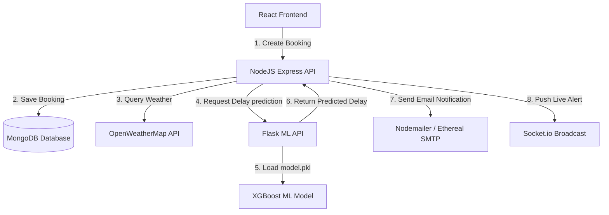
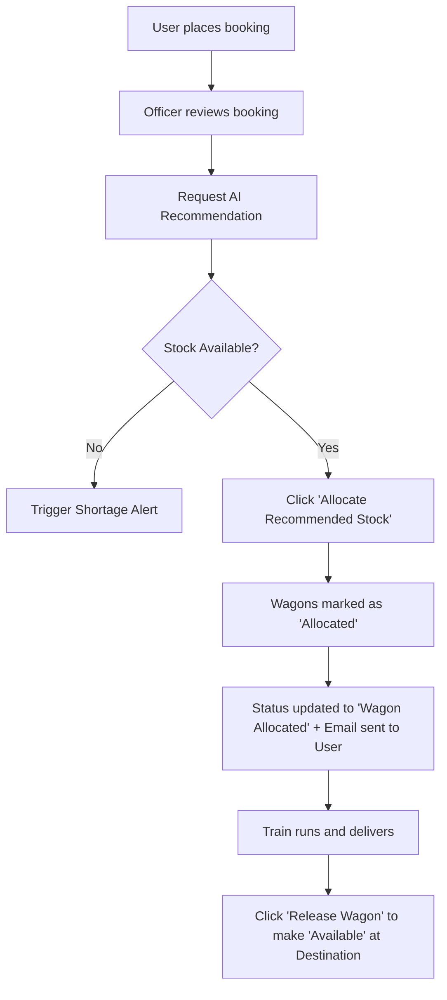

# Project Report: FreightLink AI - Intelligence Railway Logistics Scheduler

## 1. Problem Statement
In large-scale railway logistics (such as Indian Railways), the scheduling and dispatching of freight trains suffer from significant operational inefficiencies. The core issues include:
1. **Unpredictable Transit Delays:** Variations in line capacity, weather conditions (like monsoons), and station yard queues result in unexpected transit bottlenecks.
2. **Suboptimal Siding & Wagon Allocation:** Manual track assignments lead to station sidings operating at near-critical congestion, while rolling stock (wagons like open-top BOXN or covered BCN) remains idle or under-utilized.
3. **Lack of End-to-End Visibility:** Customers (shippers) face a lack of transparency regarding booking pipeline stages, estimated arrival times (ETAs), and train locations.
4. **Lack of Automated Priority Corridors:** Failure to automatically prioritize critical resource supply chains (e.g. coal shipments for power plants) causes logistics logjams.

---

## 2. The Solution (FreightLink AI)
FreightLink AI is an intelligent, full-stack decision-support system designed to automate railway cargo logistics and optimize dispatch timelines. 
* **XGBoost Machine Learning Integration:** Predicts travel delays in real-time by analyzing parameters like route distance, wagon counts, cargo weights, locomotive power, weather parameters (rainfall), and yard queue times.
* **Smart Siding & Wagon Stock Allocator:** Generates automated recommendation matrices matching cargo weight demands to nearby available wagons of the appropriate class (BOXN, BCN, BRN).
* **Control Room Telemetry:** Provides station masters and officers with real-time sliders to adjust track capacities and waiting train logs, with built-in mathematical risk modeling and automated email notifications.
* **Role-Based Pipeline:** Customers can place bookings, track transit, and get dispatches; Control Room Officers manage advanced scheduling and bypass recommendations.

---

## 3. Technology Stack & Development Tools
The system is built on a distributed, microservices-oriented architecture:

### A. Frontend (Client-side)
* **React.js & Vite:** Enables a component-driven, fast, responsive single-page application.
* **Vanilla CSS (Glassmorphism theme):** Premium dark-mode styling with translucent cards, custom gradients, and micro-animations.
* **React Leaflet (OpenStreetMap):** Displays interactive geographical train tracking maps with live congestion overlays.
* **Socket.IO Client:** Listens to real-time notification broadcasts pushed from the control room.

### B. Node.js Backend (Core Server)
* **Express.js API:** Exposes RESTful endpoints for booking processing, user roles, and system metadata.
* **MongoDB & Mongoose ODM:** Schema-based NoSQL database housing wagons, bookings, users, and audit records.
* **Socket.IO Server:** Real-time web socket server broadcasting operational state changes and alerts.
* **Nodemailer:** Handles automated HTML email delivery with Ethereal SMTP test credentials fallback.

### C. Python Machine Learning API
* **Flask Server:** A REST service bridging Node.js and the predictive ML models.
* **XGBoost Classifier/Regressor:** The serialized machine learning engine (`freight_model.pkl`) predicting transit delays.
* **Pandas & Scikit-learn:** Used for data preprocessing and validation of incoming prediction payloads.

---

## 4. System Architecture & Workflow

---

## 5. Database Schema & Models (MongoDB / Mongoose)

The backend utilizes **8 relational Mongoose models** to represent the railway grid:

### 1. User Model (`user.js`)
* **Purpose:** Stores profile data, credentials, and access roles.
* **Key Fields:**
  * `name` (String, Required)
  * `email` (String, Unique, Required)
  * `password` (String, encrypted via `bcryptjs`)
  * `role` (String, enum: `["customer", "officer", "admin"]`)
  * `govId` (String, optional - links to verified Officer IDs)

### 2. Station Model (`station.js`)
* **Purpose:** Represents railway siding terminals, track capacities, and congestion metrics.
* **Key Fields:**
  * `stationCode` (String, Unique, e.g., "NDLS", "BCT")
  * `stationName` (String)
  * `congestionLevel` (Number, 0-100)
  * `waitingTrains` (Number)
  * `availableTracks` (Number)
  * `location` (lat/lng coordinates for map routing)

### 3. Wagon Model (`wagon.js`)
* **Purpose:** Represents individual freight cars in the rolling stock.
* **Key Fields:**
  * `wagonNumber` (String, Unique, e.g., "WGN-BOXN-1002")
  * `wagonType` (String, enum: `["BOXN", "BCN", "BRN"]`) - Open, Covered, or Flatbed.
  * `capacity` (Number, load capacity in tons)
  * `status` (String, enum: `["Available", "Allocated", "Maintenance"]`)
  * `currentStation` (String, reference to Station Code)

### 4. Booking Model (`booking.js`)
* **Purpose:** Tracks cargo scheduling orders placed by Shippers.
* **Key Fields:**
  * `bookingId` (String, e.g., "BK1005")
  * `customerId` (ObjectId, references User)
  * `sourceStation`, `destinationStation` (Strings)
  * `cargoType`, `weight` (String, Number)
  * `wagonCount` (Number, calculated by volume)
  * `bookingStatus` (String, pipeline stages from `Draft` to `Delivered`)
  * `estimatedArrival` (Date)

### 5. Prediction Model (`prediction.js`)
* **Purpose:** Caches XGBoost outputs and feature contributions for audit logs.
* **Key Fields:**
  * `bookingId` (String)
  * `predictedDelay` (Number, in hours)
  * `confidence` (Number, percentage)
  * `factors` (Object, mapping SHAP contributions like congestion, weather, weight)

### 6. Notification Model (`notification.js`)
* **Purpose:** Feeds the header alert dropdown.
* **Key Fields:**
  * `userId` (ObjectId, null represents global system broadcasts)
  * `title`, `message` (Strings)
  * `status` (enum: `["unread", "read"]`)

### 7. AuditLog Model (`auditLog.js`)
* **Purpose:** Records administrative and operational transactions for accountability.
* **Key Fields:**
  * `action` (String)
  * `user` (String, email of the operator)
  * `timestamp` (Date, default now)

### 8. OfficerId Model (`officerId.js`)
* **Purpose:** Maintains a white-list of pre-authorized Government ID tokens required to create Control Room Officer accounts.

---

## 6. Backend Controllers & APIs

The logic is divided into modular controllers:

### 1. `authController.js` (Authentication Engine)
* **`register`:** Checks if email exists. If a `govId` is supplied, it validates the ID against `OfficerId` database, sets the role to `officer`, locks the ID token to prevent reuse, hashes the password via bcrypt, and issues a JWT token. It triggers the registration confirmation email.
* **`login`:** Validates credentials and returns signed JWT tokens.
* **`getProfile`:** Retrieves details of the currently authenticated token owner.

### 2. `bookingController.js` (Logistics Pipeline)
* **`bookWagon`:** Validates freight demands, counts bookings to compute a sequential code (e.g., `BK1002`), auto-calculates the required wagons (cargo weight divided by 50 tons), saves the booking, triggers a customer socket notification, alerts control room officers, writes to the audit log, and dispatches the booking confirmation email.
* **`updateBooking`:** Lets officers advance a booking through its workflow stages. If the status shifts, it populates customer data to send a status update email and broadcasts a push notification.

### 3. `wagonController.js` (Inventory Allocation)
* **`getRecommendation`:** An advanced matching algorithm. Given a booking, it evaluates cargo type to choose the correct class (e.g., open-top BOXN for Coal, covered BCN for grains). It queries available wagons at the source station siding. If there is a wagon shortage, it scans nearby hubs and calculates distance offsets. It returns a recommended list of wagons.
* **`allocateWagons`:** Marks recommended wagons as "Allocated" and advances booking status.
* **`releaseWagon`:** Releases wagons back to "Available" status at a specific terminal.

### 4. `aiController.js` (Machine Learning Bridge)
* **`predictAndSchedule`:** Connects to the Flask microservice. If the customer does not provide a rainfall value, it calls `weatherService.js` to look up live weather conditions at the origin station. It compiles the parameters, queries `/predict` on the Flask ML API, translates the prediction into an operational risk profile (Low, Medium, High, Critical), determines bypassing routes, saves the prediction cache, and writes to audit logs.
* **Fallback Mode:** If Flask is offline, it executes a mathematical delay heuristic:
  $$\text{Delay} = \frac{\text{Distance}}{40} + \frac{\text{Congestion}}{10} + \text{Weather Overhead}$$

### 5. `stationController.js` (Siding Hub Grid)
* **`updateStation`:** Updates siding tracks and waiting trains. If congestion level crosses `80%`, it broadcasts a system-wide high congestion socket warning alert to all connected yards.

### 6. `analyticsController.js` (Telemetry Aggregator)
* **`getAnalytics`:** Computes active train counts, fleet statuses, and compiles weekly daily booking volumes, monthly freight weights, and average delays to construct charts.

---

## 7. API Endpoints & Routes Configuration

### Auth Route (`/api/auth`)
* `POST /register` -> Register user (Customer/Officer).
* `POST /login` -> Authenticate user.
* `GET /profile` -> Get current user profile.

### Bookings Route (`/api/bookings`)
* `POST /` -> Create a booking (Customer).
* `GET /` -> Get bookings (Filtered: customer sees their own; officer sees all).
* `GET /:id` -> Get booking details by ID.
* `PUT /:id` -> Update booking fields/status (Officer).
* `DELETE /:id` -> Cancel booking.

### Wagons Route (`/api/wagons`)
* `GET /` -> List all wagons in the siding network.
* `GET /recommendation` -> Get AI wagon matching recommendation.
* `POST /allocate` -> Allocate stock.
* `POST /release` -> Release stock.

### AI Route (`/api/ai`)
* `POST /predict-and-schedule` -> Get XGBoost delay predictions.
* `GET /sample-data` -> Fetch standard baseline inputs.
* `GET /history` -> Fetch prediction log cache.

### Stations Route (`/api/stations`)
* `GET /` -> Fetch all terminals.
* `POST /` -> Create a terminal (Admin).
* `PUT /:id` -> Edit siding parameters (Officer/Admin).

### Analytics Route (`/api/analytics`)
* `GET /` -> Fetch aggregated KPI metrics.

---

## 8. Frontend Components (Client UI)

The user interface uses custom CSS layout systems:
1. **`App.jsx` (Global Router & Socket Listener):** Coordinates active tabs and initializes the primary Socket.IO connection to intercept and render warning sounds and alert indicators.
2. **`AIPanel.jsx` (XGBoost Delay Optimizer):** Displays the main delay prediction form, haversine distance helper, SHAP explainability charts, and circular delay risk profile gauges.
3. **`Operations.jsx` (Control Room):** Contains tables representing the booking pipeline, siding inventories, available wagon stock releases, and interactive sliders to adjust terminal tracks/waiting trains on the fly.
4. **`TrainTracking.jsx` (Live Siding Tracker):** Renders a Leaflet map. Stations are color-coded dynamically according to their active congestion level (Green $\le$ 50%, Yellow $\le$ 80%, Red $>$ 80%).
5. **`AnalyticsView.jsx` (SVG Dashboard):** Renders custom vector graphics (Area, Line, and Donut charts) built dynamically from database aggregates without external heavy plotting libraries.

---

## 9. Machine Learning Model details

The project contains a serialized pre-trained **XGBoost (Extreme Gradient Boosting) Regressor** model (`freight_model.pkl`) which has been trained on a simulated dataset of 50,000 freight trips (`freight_dataset_final_50k.csv`).
* **Input Features:**
  1. `distance` (km)
  2. `wagon_count` (number of wagons)
  3. `total_weight` (cargo weight in tons)
  4. `locomotive_power` (engine horsepower)
  5. `congestion_level` (current terminal congestion, 0-100%)
  6. `rainfall` (precipitation level in mm)
  7. `avg_wait_time` (average siding wait time in minutes)
* **Target Output:**
  * Predicted delay in hours (`delay`).
* **Performance Metrics:**
  * R-squared Score ($R^2$): **0.79** (explains 79% of variance in delays).
  * Mean Absolute Error (MAE): **4.25 hours**.

---

## 10. Core Algorithms & Systems Highlight

### A. Real-time Station Congestion Formula
The congestion value of a railway terminal is computed dynamically using normalized parameters:
$$\text{Congestion Level (\%)} = \left[ 0.40 \times \left( \frac{\text{waitingTrains} - 2}{13} \right) + 0.35 \times \left( \frac{\text{yardOccupancy} - 40}{50} \right) + 0.25 \times \left( \frac{\text{wagonUtilization} - 30}{65} \right) \right] \times 100$$
This guarantees that the calculated congestion scales perfectly from 0% (optimal baseline status) to 100% (absolute yard gridlock).

### B. Dynamic SMTP/Ethereal Fallback System
The system implements a zero-configuration developer email setup. If standard SMTP server variables (`SMTP_HOST`, `SMTP_PORT`, `SMTP_USER`, `SMTP_PASS`) are missing from the `.env` file, the backend automatically logs into the **Ethereal dynamic testing node**, creates transient credentials, sends the beautifully designed HTML emails (for registrations and bookings), and prints a clickable preview URL in the Node console.

### C. Smart Siding Wagon Allocation Logic & Workflow
The rolling stock allocation module implements an intelligent matchmaker that assigns optimal wagons to user orders.

#### 1. Allocation Criteria
* **Cargo-to-Class Matching (Wagon Type):**
  * **`BOXN` (Open-top Wagons):** Selected for bulk, open-air raw materials like **Coal, Iron Ore, Minerals, and Sand**.
  * **`BRN` (Flatbed Wagons):** Selected for structural or heavy items like **Steel, Rails, Heavy Machinery, and Shipping Containers**.
  * **`BCN` (Covered Wagons):** Default selection to protect weather-sensitive items like **Cement, Grains, and Fertilizers**.
* **Proximity & Siding Priority (Heuristics):** To avoid empty-run overheads, the algorithm prioritizes available wagons parked at the booking's `sourceStation`. If needed, it gathers additional stock from the closest neighboring hubs.
* **Weight Capacity Accumulation:** Adds up individual wagon capacities (e.g., 50–60 tons per wagon) until the total capacity satisfies the ordered cargo weight. If available stock is insufficient, it triggers a system-wide **"Wagon Shortage Alert"** in the Control Room.

#### 2. Operations Workflow

